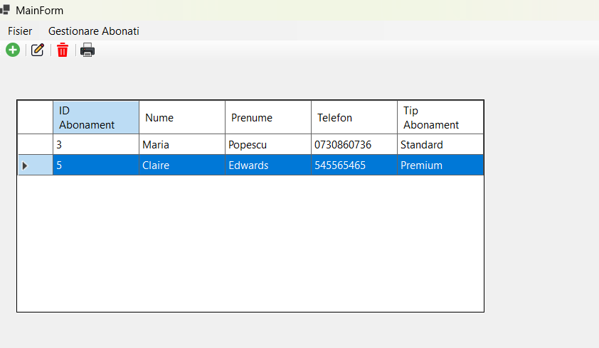
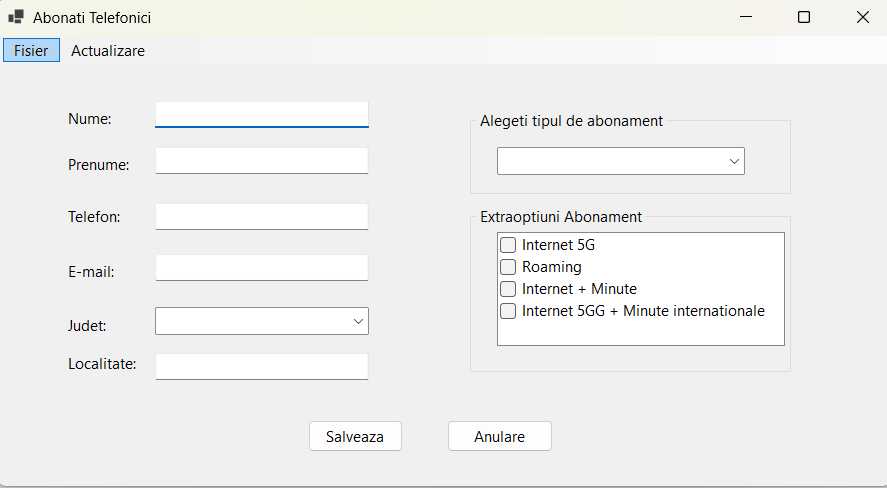
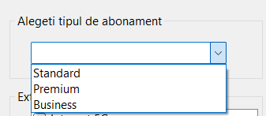

# Phone Subscribers Management App

A desktop application made in C# WinForms for managing phone subscribers, subscriptions, extra options and payments. The project was created to practice and deepen my knowledge of Object Oriented Programming(OOP) in C#.The main goal was to create a simple application where subscribers, subscriptions and payments can be managed from one place.

The project uses Entity Framework to work with a SQL database. It also includes some simple features for importing/exporting data and printing invoices.

## Features

### Subscribers

- Add new subscribers
- Edit subscriber information
- View subscribers in a table
- Delete subscribers
- Store basic information such as name, phone number and adress

  

  

### Subscriptions

Choose a subscription type such as: 
- Standard
- Premium
- Unlimited

  

### Add extra options, for example:
- Mobile data packages
- TV chanels
- Roaming

### Payments:
- Add and view payments made by a subscriber
- Keep a simple payment history

### Database:
- Store the client information in a SQL database
- Import and export data from text files

### Invoices:
- Generate an invoice for a subscriber
- Print the invoice
- Preview the invoice before printing

### Validation:
- Check required fields
-  Validate phone numbers
-  Validate email adresses
-  Use `ERROR PROVIDER` to show validation errors

## Technologies and Frameworks used: 
- C#
- .NET Framework
- Windows Forms (WinForms)
- SQL SERVER/ LocalDB
- Visual Studio

  ## Project Structure:

- `Client.cs` - contains the client information
- `DatabaseAbonati.cs` - handles the database connection
- `ExtraOptiuni.cs` - contains the extra subscription options
- `Plati.cs` - contains payment information
- `TipAbonament.cs` - contains the subscription types
- `Form1.cs` - form used for adding and editing subscribers
- `MainForm.cs` - main form of the application
- `Program.cs` - starts the application

  

